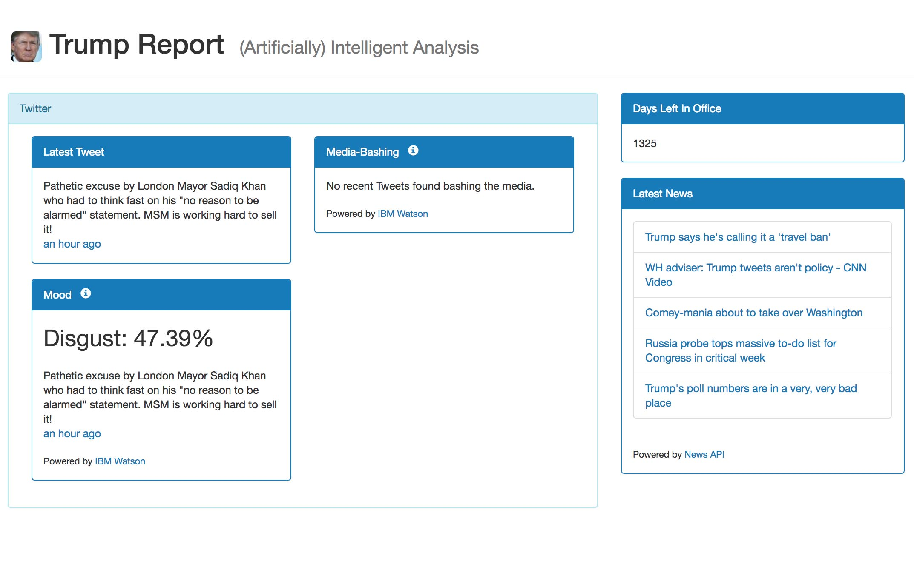

# Trump Report

Hobby project I wrote to do some AI analysis of Trump tweets.

* Live demo at [https://tr.david-merrick.com/](https://tr.david-merrick.com/)
* Completely serverless architecture; hosted on S3 and uses AWS Lambda for API endpoints
* Uses IBM Watson's Cognitive API for analysis

## Current features

* Countdown of days left in office
* Latest Tweet
* Last time he bashed the media on Twitter
* Latest news
* Mood in the last day (Perhaps using IBM Watson API to analyze Tweets)

## Proposed features

* Current odds of impeachment

## API Endpoints

Source code for API endpoints can be found here:
* https://github.com/davidmerrick/lambda-tweet-classifier
* https://github.com/davidmerrick/lambda-tone-analyzer
* https://github.com/davidmerrick/lambda-get-tweets
* https://github.com/davidmerrick/lambda-get-news

## Reference

* [Watson API docs](https://www.ibm.com/watson/developercloud/doc/index.html)
* [Twitter API docs](https://dev.twitter.com/rest/public)
* [News API docs](https://newsapi.org/#sources)